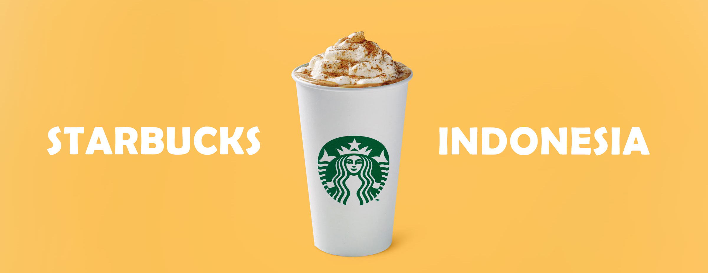

<h1 align="center">Selamat datang di Starbucks! 👋</h1>

  

 
        

	
    

### 🎁 Apa itu StarbucksDIY
Starbucks Corporation adalah sebuah perusahaan kopi dan jaringan kedai kopi global asal Amerika Serikat yang berkantor pusat di Seattle, Washington. Starbucks adalah perusahaan kedai kopi terbesar di dunia,dengan 20.336 kedai di 61 negara dan **326 di Indonesia.** Starbucks menjual minuman panas dan dingin, biji kopi, salad, sandwich panas dan dingin, kue kering manis, camilan, dan barang-barang seperti gelas dan tumbler.

### 🤔 Tujuan 
Web ini di bangun dengan express js, angular, dan menggunakan database Mysql untuk memenuhi tugas kuliah Pemrograman Web yang di buat dengan 3 orang Backend Developer dan 3 orang Frontend Developer

### 🤨 Fitur apa saja yang tersedia ?
- Admin login system
- Upload promo ke halaman user by admin
- Upload Menu ke halaman user by admin
- Inpute Feedback dari halaman user oleh user
- Kelola data admin
- Kelola data team
- Kelola data menu
- Kelola data promo
- Kelola data feedback
- Menu Services
- Menu Sejarah Starbuck
- Menu kontak

### ✨ Demo
- <a href="http://starmindiy.mercedes1.host/">Klik</a> me untuk demo 

 ### 👤 Default Account for testing
	
**Admin Default Account**
- http://localhost:8011/login
- Username : efri
- Password : efri

### 🧐 Persyaratan yang di perlukan
